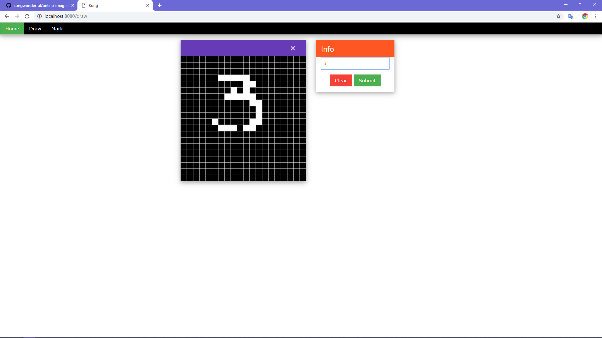

## Try it yourself
+ `node --version === "v10.14.2"`
+ `npm install`
+ `npm start`
+ Open [http://localhost:8080](http://localhost:8080) in your browser

## Description
+ Online image labeling tool for machine learning research
+ Based on Node.js
+ Image data and labels are stored in data.csv

## TODO
- [ ] Allow users to select different data sets to contribute
- [ ] For digital type images, press the number keys to quickly submit the data.
- [ ] Allow users to view their own history and tasks to be completed

## Screenshots
**Draw page**

## Reference
+ [神经网络实现手写字符识别系统](https://www.shiyanlou.com/courses/593/labs/1966/document)
+ [500 lines ocr code](https://github.com/aosabook/500lines/tree/master/ocr/code)